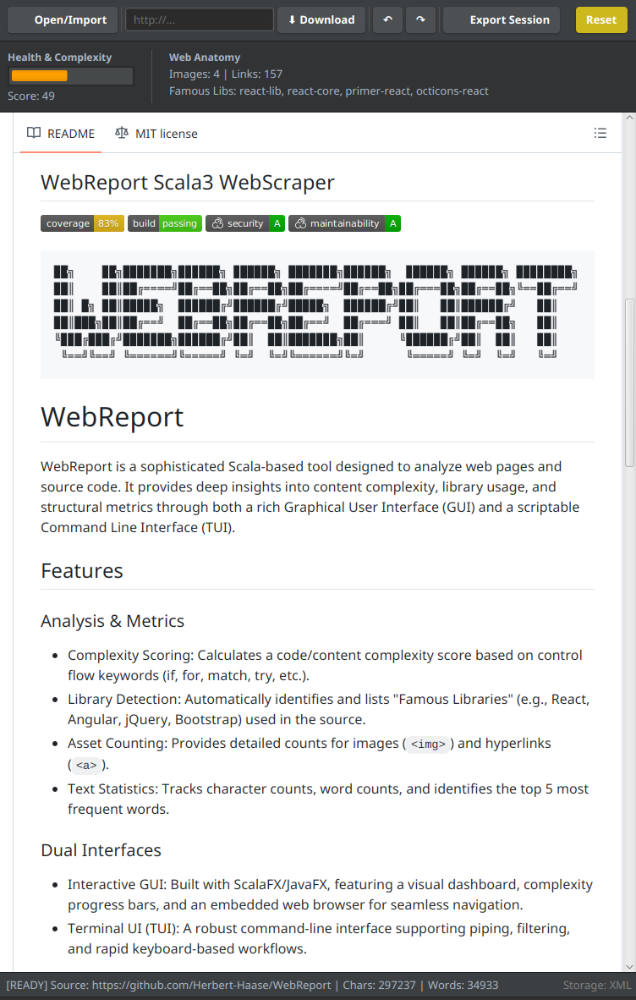

## WebReport Scala3 WebScraper
[](https://coveralls.io/github/Herbert-Haase/WebReport?branch=main)

[](https://sonarcloud.io/summary/new_code?id=Herbert-Haase_WebScraper)
[](https://sonarcloud.io/summary/new_code?id=Herbert-Haase_WebScraper)

```text
██╗    ██╗███████╗██████╗ ██████╗ ███████╗██████╗  ██████╗ ██████╗ ████████╗
██║    ██║██╔════╝██╔══██╗██╔══██╗██╔════╝██╔══██╗██╔═══██╗██╔══██╗╚══██╔══╝
██║ █╗ ██║█████╗  ██████╔╝██████╔╝█████╗  ██████╔╝██║   ██║██████╔╝   ██║   
██║███╗██║██╔══╝  ██╔══██╗██╔══██╗██╔══╝  ██╔═══╝ ██║   ██║██╔══██╗   ██║   
╚███╔███╔╝███████╗██████╔╝██║  ██║███████╗██║     ╚██████╔╝██║  ██║   ██║   
 ╚══╝╚══╝ ╚══════╝╚═════╝ ╚═╝  ╚═╝╚══════╝╚═╝      ╚═════╝ ╚═╝  ╚═╝   ╚═╝
```


# WebReport

WebReport is a sophisticated Scala-based tool designed to analyze web pages and source code. It provides deep insights into content complexity, library usage, and structural metrics through both a rich Graphical User Interface (GUI) and a scriptable Command Line Interface (TUI).

<p align="center">
  
</p>

## Features

### Analysis & Metrics
- **Complexity Scoring**: Calculates a code/content complexity score based on control flow keywords (if, for, match, try, etc.).
- **Library Detection**: Automatically identifies and lists "Famous Libraries" (e.g., React, Angular, jQuery, Bootstrap) used in the source.
- **Asset Counting**: Provides detailed counts for images (``) and hyperlinks (`<a>`).
- **Text Statistics**: Tracks character counts, word counts, and identifies the top 5 most frequent words.

### Dual Interfaces
- **Interactive GUI**: Built with ScalaFX/JavaFX, featuring a visual dashboard, complexity progress bars, and an embedded web browser for seamless navigation.
- **Terminal UI (TUI)**: A robust command-line interface supporting piping, filtering, and rapid keyboard-based workflows.

### Persistence & State Management
- **Session Export/Import**: Save your analysis history to XML or JSON formats and reload them later to restore your session state.
- **Undo/Redo Stack**: Full implementation of the Command Pattern allows you to step backward and forward through every action (download, filter, load).

## Getting Started

### Prerequisites
- **Java JDK 11 or higher** (JDK 21 Recommended).
- **sbt** (Scala Build Tool).

### Installation
1. Clone the repository:
```bash
   git clone https://github.com/Herbert-Haase/WebReport.git
   cd WebReport
```

2. Run the docker:
```bash
   ./docker-run.sh
```


3. Run the application:
```bash
   run
```

## Usage Guide

### Graphical User Interface (GUI)
The GUI provides a visual dashboard for analyzing content.

- **Navigation**: Enter a URL in the toolbar or click links within the embedded browser to analyze new pages automatically.
- **Toolbar**:
  - **⬇ Download**: Fetches and analyzes the URL in the text field.
  - **📂 Open/Import**: Load a text file or import a saved `.xml`/`.json` session.
  - **💾 Export Session**: Save your entire analysis history.
  - **↶ / ↷**: Undo or Redo your last action.
- **Dashboard**: View real-time metrics, including the complexity score bar and detected libraries.

### Terminal User Interface (TUI)
The TUI is perfect for quick analysis and keyboard-centric users.

**Commands**:

| Command    | Arguments    | Description                                                      |
| :--------- | :----------- | :--------------------------------------------------------------- |
| `download` | `<url>`      | Downloads and analyzes the content from the specified URL.       |
| `load`     | `<filepath>` | Loads a text file or imports a session (`.xml` or `.json`).      |
| `text`     | none         | Enters multi-line input mode. Type `.` on a new line to finish.  |
| `filter`   | `<word>`     | Filters the current view to show only lines containing `<word>`. |
| `ln`       | none         | Toggles line numbers in the output.                              |
| `save`     | interactive  | Prompts for a filename to export the current session.            |
| `undo`     | none         | Reverts the last state change.                                   |
| `redo`     | none         | Reapplies the last undone action.                                |
| `reset`    | none         | Clears all data and resets the application state.                |
| `exit`     | none         | Closes the application.                                          |

## Architecture
WebReport follows a clean, modular architecture designed for testability and extensibility:

- **MVC Pattern**: Separation of Model (Data/Logic), View (TUI/GUI), and Controller (SessionManager).
- **Observer Pattern**: The SessionManager notifies both the TUI and GUI of state changes, ensuring both views stay synchronized.
- **Command Pattern**: All state-modifying actions (Download, Load, Filter) are encapsulated as commands, enabling the robust Undo/Redo system.
- **Strategy Pattern**: File persistence is handled via a generic FileIO interface, allowing hot-swapping between XmlFileIO and JsonFileIO implementations.

## Technologies
- **Language**: Scala 3
- **Build Tool**: sbt
- **GUI Framework**: ScalaFX / JavaFX
- **Serialization**: Play-JSON, Scala-XML
- **Dependency Injection**: Google Guice
- **Testing**: ScalaTest

## License
This project is licensed under the MIT License - see the [LICENSE](https://github.com/Herbert-Haase/WebReport/blob/main/LICENSE) file for details.
